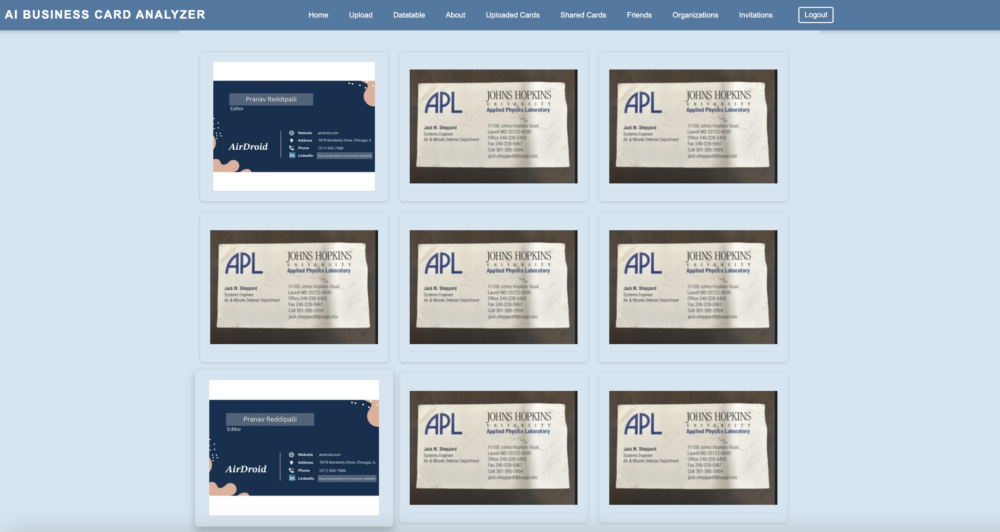
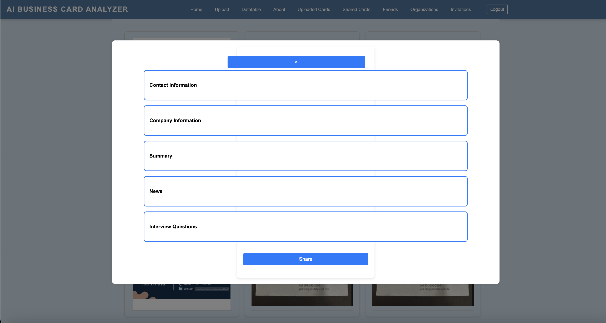
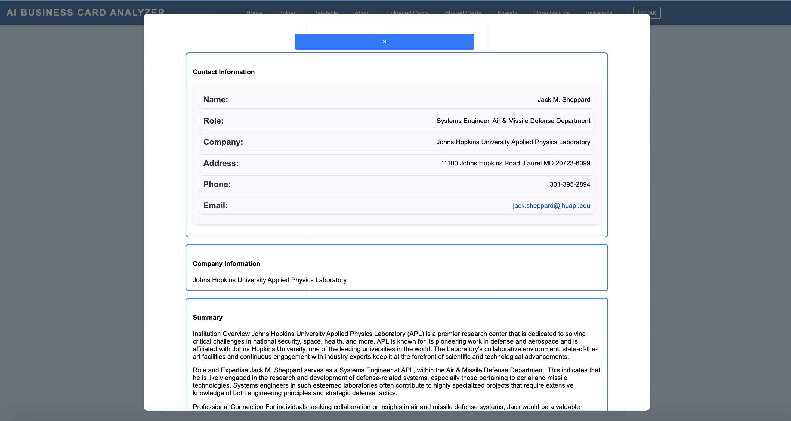
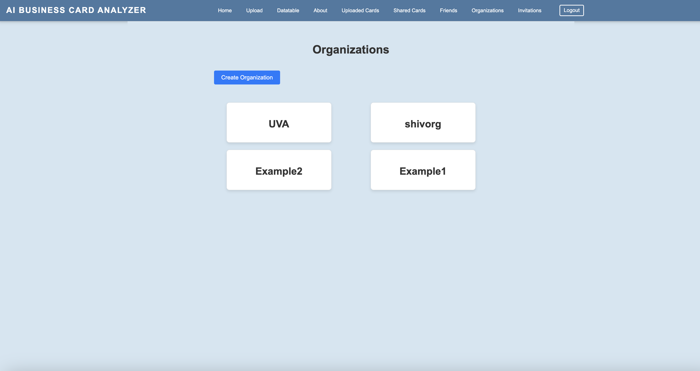

# AI Business Card Analyzer

## Overview

The **AI Business Card Analyzer** is a personal project designed to digitize and organize business cards collected during job fairs and networking events. This application uses **TensorFlow** and **OpenAI** APIs to analyze business card images, extract contact information, and generate summaries about the companies and individuals on the cards. It also offers features like sharing cards, adding comments, and organizing cards for easy access and search.

### Key Features:
- **Image Analysis**: Uses AI to extract and display contact information.
- **Company and Role Summaries**: Automatically generates summaries using trained GPT model, web scraping, and APIs.
- **Commenting System**: Users can add comments to the analysis for future reference.
- **Sharing with Friends**: Share business cards, comments, and analyses with friends and groups.
- **Easy Search**: Organized and searchable by keywords from the extracted analysis.

## Technologies Used:
- **Front-end**: ReactJS
- **Back-end**: AWS Lambda, API Gateway
- **Authentication**: Google Firebase
- **Data Storage**: AWS DynamoDB
- **Machine Learning**: TensorFlow and OpenAI API
- **Web Scraping**: Integrated to fetch external sources

## Example Photos
- **All Card View
- 
- **Analysis Structure
- 
- **Analysis View
- 
- **Organizations/Group Chat
- 


### 1. Install Yarn

If you don't have Yarn installed on your system, you can install it by following these steps:

- Using Homebrew (for macOS):
  ```bash
  brew install yarn
### 2. Clone the Repository


- Using Homebrew (for macOS):
  ```bash
  git clone https://github.com/your-username/ai-business-card-analyzer.git

### 3. Install Dependencies

If you don't have Yarn installed on your system, you can install it by following these steps:

- Using Homebrew (for macOS):
  ```bash
  cd ai-business-card-analyzer
  yarn install

### 4. Start the Development Server


- Using Homebrew (for macOS):
  ```bash
  yarn start

### 5. Build for Production


- Using Homebrew (for macOS):
  ```bash
  yarn build
